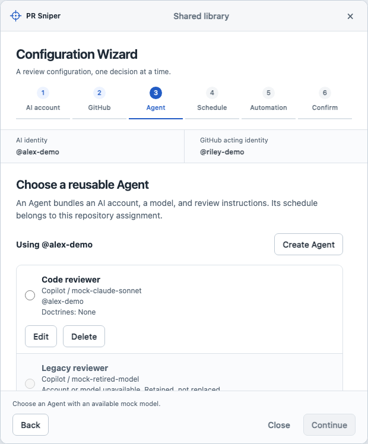
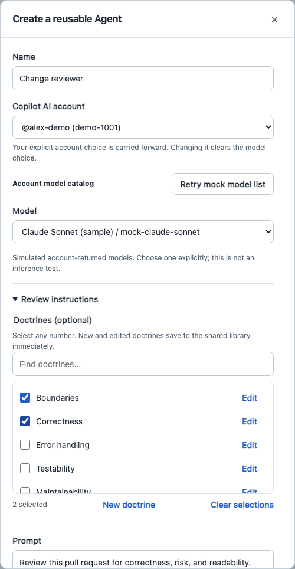

# Configuration Wizard mock

A standalone, clickable HTML prototype. Open `index.html` directly in a
browser; no install, build, Tauri process, or application wiring is needed.
For a stable browser-storage origin, serve this folder locally:

```sh
python3 -m http.server 4178 --bind 127.0.0.1 --directory poc/configuration-wizard
```

Open `http://127.0.0.1:4178`. This is a UI proposal, not an implementation
of PR Sniper's provider, monitoring, review, or publication behavior.

## Visual evidence

These captures use fictional accounts and models. They document the interaction
idea, not native acceptance or live provider behavior.





## Explore

Six steps: AI account, GitHub account/repository, reusable Agent, schedule,
independent automation gates, and confirmation. No account, repository, Agent,
or model is silently picked. The initial schedule also requires a choice.

- Choose existing fixtures or simulate sign-in and explicit identity confirmation.
  Confirmation connects that mock account immediately for its AI or GitHub role.
- Create, edit, or delete an Agent in the wizard or **Shared library**. Each
  operation updates the same shared resource immediately. New/changed model
  selections require a simulated account-specific catalog; unavailable saved
  selections remain loadable without being silently replaced.
- Select zero, one, or any number of doctrines under **Review instructions**.
  The expanded sample library has a scrollable, keyboard-accessible checklist
  and search. Filtering preserves selections; checkbox selections have no cap,
  appear in Agent/confirmation summaries, and persist with the mock Agent.
  Create/edit/delete doctrines inline or in **Shared library**. Doctrine edits
  update all referring Agents; a newly created doctrine survives even if the
  containing Agent form is closed without creating that Agent.
- Try interval presets, custom intervals, and five-field cron. Time zones appear
  only for cron; elapsed intervals neither display nor validate a time zone.
- Toggle all four combinations of auto-start and auto-post independently.
- Use **Prototype controls** for empty, held-loading, error, and reconnect
  states on the first three steps. Error on Confirm simulates a failed save.
  Schedule and Automation are local choices; use their fields to test validation.
- Model lookup inherits the scenario chosen in **Prototype controls** before
  opening the Agent dialog; no developer-only scenario controls appear inside
  that dialog. Retry recovers empty/error/loading fixtures; reconnect requires
  closing the dialog and confirming the AI identity again.
- The wizard is navigation, not a transaction: no Save for later, resume,
  saved progress, rollback, or discard prompts. Closing resets only its current
  selection flow, never connections or resource CRUD already completed.
- Final **Save configuration** applies the repository/Agent assignment,
  schedule, and independent gates. Already-completed resource changes do not
  depend on this final button.
- **Reset demo** resets only this prototype's namespaced browser resources.
- **Done** returns to a mock menu-bar landing state. Edit the saved configuration
  or configure another repository.

Everything is a fixture. There are no external assets, dependencies, provider
requests, credential inputs, inference, GitHub mutations, or application commands.
A restrictive Content Security Policy blocks network connections and form
submissions. The only persistence is the
`pr-sniper.poc.configuration-wizard.v1` localStorage key. Version 3 stores a
shared library, role-local connections, and repository configurations, not
wizard progress. Older versions preserve their Agents/doctrines and completed
configurations during migration. Storage failures leave the prior resources
unchanged and report an error; do not enter secrets or real credentials.

## Design and decision boundaries

Uses the slate/blue tokens and system typography in
`docs/agent/design/settings-default.md`, not its superseded section topology or
implicit default-model wording. Current reusable Agent/account boundaries come
from `src/policy.ts`, `src/settings.ts`, and the Copilot amendment in
`docs/agent/specs/pr-sniper-mvp.nano.md`.

Multiple doctrines per Agent and immediate shared-resource CRUD reflect the
operator's prototype corrections. Production schemas and application code are
unchanged.

Prototype-only choices for iteration: six-step order; one repository/Agent per
pass; carrying explicit account choices into a second configuration;
assignment-level schedule/gates. These do not resolve product
Discovery or migrate the application's policy schema. Watchlists, reviewer
triggers, custom signatures, login items, and next-run
calculation are intentionally outside this mock. Cron validation checks common
five-field syntax only, not production scheduler semantics or DST behavior.

Keyboard: Tab/Shift+Tab, native radio/select keys, Escape to close the wizard or
active dialog, and Command/Ctrl+Enter to save on the final step. Dialogs trap
focus and restore it; step navigation focuses the new heading. There is no
decorative motion, and reduced-motion preferences are explicitly respected.

## Regression check

With the repository's existing Playwright development dependency and Chromium
available, run `node poc/configuration-wizard/smoke.cjs`. This opens the HTML in
an isolated headless browser, requires no app build or server, and checks the
interactive flow, role/account/model isolation, immediate shared-resource CRUD,
closure without rollback, error states, independent gates, actual doctrine-list
wheel/keyboard scrolling and search, compact layout, keyboard focus, failed
storage, and zero network requests.
