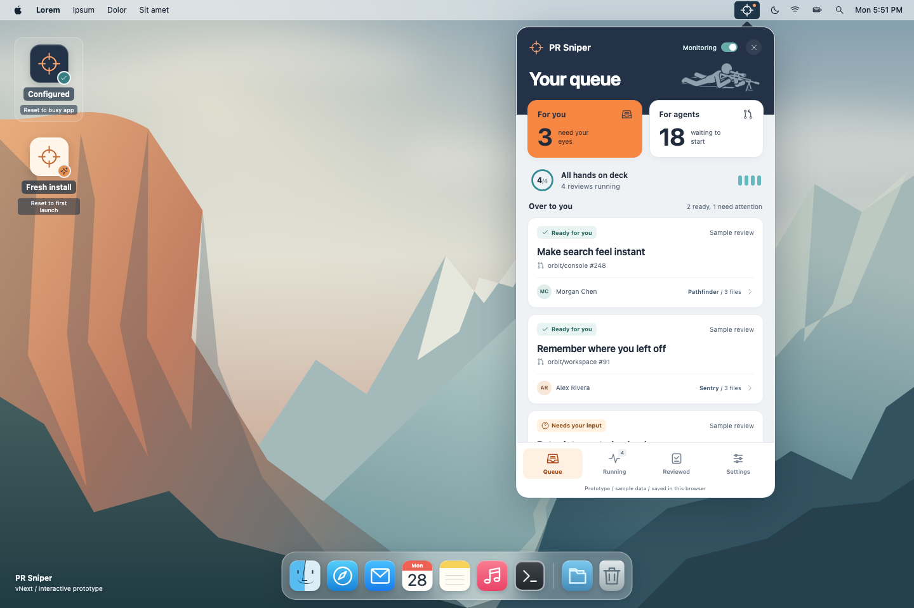
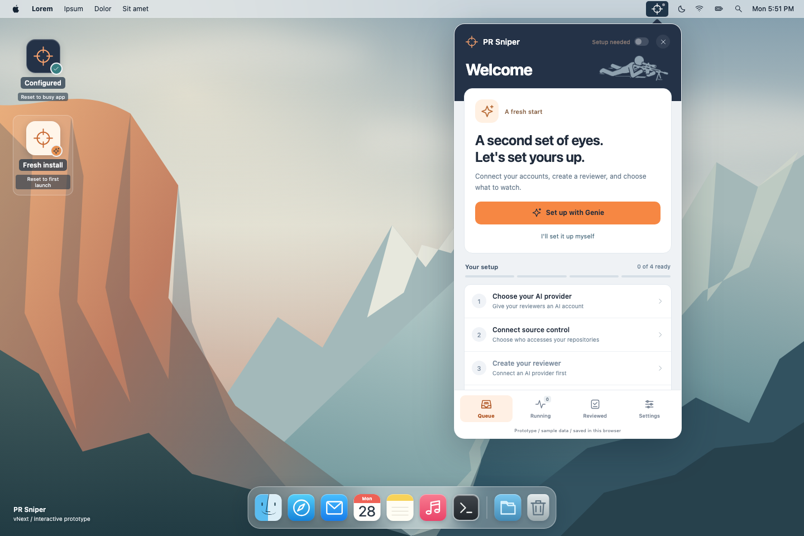

# PR Sniper vNext prototype

Human-directed work for [#52](https://github.com/jdylanmc/pr-sniper/issues/52),
under [Design vNext #51](https://github.com/jdylanmc/pr-sniper/issues/51).
This is a local design prototype, not production application code.

## Approved direction

Human-approved on **2026-09-28**: the compact desktop/popover layout, navy header,
orange/teal accents, and supplied header reference treatment. Keep the four app
destinations, independent Agent count and review capacity, explicit demo resets,
guided Genie setup, and read-only PR evidence with human review on GitHub.
This approves the POC direction, not production authentication, provider approval,
concurrency, native tray, or Windows behavior.

## Open

Open `prototypes/v2/index.html` directly, or serve the prototype from the
repository root for consistent browser-local persistence:

```sh
python3 -m http.server 4178 --bind 127.0.0.1 --directory prototypes/v2
```

Open `http://127.0.0.1:4178`. No build, external fonts, CDN, or installation is
needed. The desktop clock is real; the desktop, accounts, models, PRs, evidence,
and outcomes are synthetic.

## Visual evidence

Two Chromium captures of the approved prototype, using synthetic fixtures.
Click either image for the full-size view. The header reference-treatment
provenance and production-clearance limit below also apply to these captures.

**Configured queue:** human handoffs, queued work, and four running reviews.

[](evidence/configured-queue.png)

**Fresh install:** empty setup, monitoring off, and the Genie welcome/checklist.

[](evidence/fresh-install-welcome.png)

## Two desktop starting states

Click either desktop shortcut to **reset and open** that scenario:

- **Configured:** the busy app, with three accounts, six agent configurations,
  three repositories, eighteen queued reviews, four running, and three needing
  human attention.
- **Fresh install:** no accounts, agents, repositories, reviews, or history.
  Monitoring and automatic start/publication are off. Concurrency defaults to
  four; three bundled example doctrines are available but not assigned.

Every shortcut click replaces previous prototype edits, even when clicking the
currently selected scenario. The shortcuts are explicit reset controls, not
separate retained profiles. They never touch the real application.

### Onboarding Genie

Fresh install opens a welcoming checklist with a **Set up with Genie** button.
The button opens a guided wizard:

1. Choose an **AI provider**, then connect and confirm a mock identity.
2. Choose a **PR platform**, then connect its repository-access identity.
3. Create an Agent with an explicitly selected account, model, prompt, and
   completion/comment permissions.
4. Configure a repository: acting account, assignment, watched people, scope,
   schedule, and independent review-start/comment gates.
5. Review the effective setup, confirm it, and **Start monitoring** to enter the
   normal app with that setup.

No provider is preselected. Copilot is the first available AI integration;
Claude, Codex, and Grok remain disabled **Coming soon** choices. GitHub is the
available PR platform, with Azure DevOps shown as **Coming soon**.

Genie reuses the existing account, Agent, repository, and concurrency editors.
Progress is derived from actual saved resources, not which buttons were clicked.
You can use the checklist or Settings manually and return to Genie.
Confirmed connections and saved configurations persist immediately; Back, Cancel,
or closing the panel does not undo them. Pending sign-in and unsaved fields are
not persisted on reload. There is no separate wizard settings store.

Monitoring stays off until the final confirmed review. Missing accounts, unusable
Agents, unconfirmed scope, or missing assignments prevent completion. Completing
Genie does **not** load the busy fixture or invent PRs. Use **Simulate a repository
check** when you want to introduce sample work.

## App destinations

| Destination | Working mock interactions                                                                                                            |
| ----------- | ------------------------------------------------------------------------------------------------------------------------------------ |
| Queue       | Human/agent lanes, detail pages, trust confirmation, manual start, retries, and simulated detection.                                 |
| Running     | Capacity, agent and PR ownership, stepped activity, interruption, and explicit sample completion.                                    |
| Reviewed    | Filtered outcomes, synopsis, findings, ordered file guide, read-only conversation, stale/recovery scenarios, and a PR-platform link. |
| Settings    | Account mocks, Agent/doctrine CRUD, repository assignments/watchlists/schedules/permissions, concurrency, preferences, and reset.    |

Pages slide inside the popover. Back preserves list position, and destinations
retain their navigation stacks. Escape, close, or outside click dismisses the
panel without losing an open editor. Leaving a dirty editor asks before discarding.

### Human review belongs on the PR platform

PR Sniper prepares the evidence and the changed-file guide. **Open pull request
on GitHub** opens that item's PR URL in a new tab. Human comments, decisions,
approval, and merge belong on GitHub, not in a recreated review interface here.
There is no in-app human-note editor, mark-reviewed action, or manual findings
publication control. Existing sample conversation/history remains read-only.

PR URLs refer to fictional fixtures and may not exist. Links open only on an
explicit click, with `noopener noreferrer`; no review action or mutation follows
from navigation. Agent execution/trust controls and explicitly labeled scenario
controls remain mock application controls, not human PR-review authoring.

### Workload and permissions

- Saved Agent count is unlimited and independent of concurrent-review capacity.
- Global Monitoring **off** cancels active sample reviews, discards partial work,
  and requeues the packets. The configured fixture becomes **22 queued / 0 running**.
- Resume creates fresh attempts. Lowering concurrency similarly requeues surplus
  attempts. Scheduling order and cancellation selection are illustrative policies.
- Complete a running sample as clear, findings, human judgment, or invalid output.
  A cleared review uses its Agent permission: simulated provider approval or human
  handoff. Approval is never merge. There are no completion timers or invented
  progress percentages.
- Review start, comment publication, Agent permissions, scope, and trust stay
  separate. Local findings are not described as published. Connection and
  assignment problems remain visible blockers.
- Watched-author filters apply before detection. Empty means all authors after
  activation, without granting trust.
- Stale retry creates a new sample head while retaining earlier evidence.
  Invalid output never becomes a published result.

### Accounts and persistence

**Settings > Accounts > Add account** shows repository and AI providers.
GitHub/Copilot use a fictional handle and simulated browser sign-in, followed by
an explicit identity confirmation. No OAuth page, device code, or credential
request is involved. Cancel and failed sign-in create no account.

Only **Confirm and connect** saves the account. GitHub identities appear only in
repository selectors; Copilot identities appear only in AI selectors. Existing
bindings, monitoring state, and review work remain unchanged. Duplicate handles
within one provider are rejected. Direct AI integrations are distinct from models
offered through Copilot.

The active scenario and saved mock state use **`pr-sniper.vnext.v2`** in
`localStorage`. No other key is changed. Reload restores setup/workload without
advancing running reviews. File-URL storage differs across browsers; localhost is
recommended. **Settings > Advanced > Reset prototype** confirms before resetting
the current scenario. Desktop reset shortcuts intentionally do not ask again.

Shared resource edits update their uses; affected active attempts restart rather
than silently changing a pinned review. Historical snapshots remain intact.
Referenced resources cannot be deleted without resolving their uses.

Repository saves validate only the selected schedule. Inactive schedule fields
retain their last saved values (or fixture defaults for a new repository), not
unsaved edits made before switching modes.

Malformed saved data is reported without overwriting it. Failed saves do not
claim success or update in-memory state. Competing tabs require reload before
saving over changed data. Existing v2 data without scenario metadata is treated
as the configured app, not forced through onboarding.

## Deliberate limits

There is no Tauri bridge, production configuration, actual authentication,
inference, provider API, publication, notification, or OS login-item operation.
`connect-src 'none'` blocks API requests; the explicit PR link is ordinary browser
navigation. Startup/notification controls save preferences only.

The mock has no existing-backlog import, reviewer-assignment editor, real
polling/cron execution, provider pagination, multi-Agent consensus, autonomous
thread follow-up, or provider reconciliation. Cron validation checks five-field
shape and IANA time zone, not execution semantics. File guides contain the complete
three-file fixture, not a real repository inspection. Signature customization
remains separate #30 work.

Genie follows the shared-resource principle of the Configuration Wizard in #41,
but is not that wizard's production implementation or proof of native acceptance.
No prerequisite installer or Setup Doctor is introduced.

The header's `sniper-mark.png` is a transparent, single-color crop of the
human-supplied simplified-figure reference, without its frame, caption, or extra
crosshair. It is a prototype reference treatment, not original-artwork or
production-asset clearance. The crosshair remains the tray icon; the local
`wallpaper.svg` is an original illustration.

Do not enter secrets or workplace data. Nothing here authorizes production rollout.

## Checks

From the repository root:

```sh
node --test prototypes/v2/model.test.cjs
node prototypes/v2/browser.test.cjs
node prototypes/v2/onboarding.browser.test.cjs
```

Browser checks need the preview server, the repository's existing Playwright
dependency, and installed Chromium/WebKit browsers. If the isolated worktree
has no dependencies, point `NODE_PATH` at an existing checkout's `node_modules`;
do not add prototype dependencies. Set `PROTOTYPE_SCREENSHOTS` to an artifact
directory to capture screenshots. Checks use isolated browser contexts, never
the operator's saved session, and do not follow the external sample PR link.
